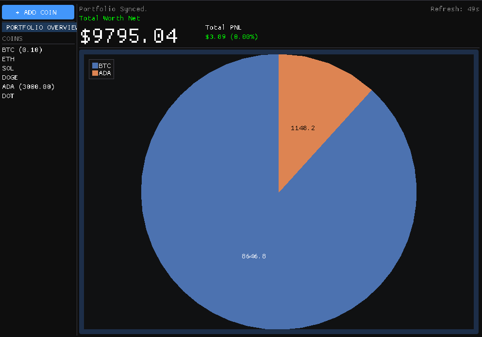
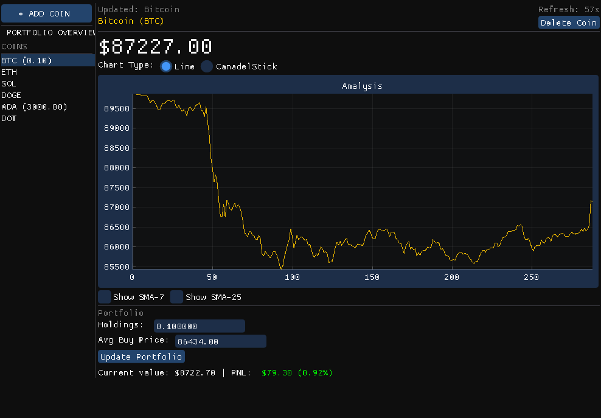

# MarketTracker

A C++ desktop application for tracking and visualizing cryptocurrency market data in real-time.

## Table of Contents

- [Features](#features)
- [🖼️ Screenshot](#️-screenshot)
- [�️ Dependencies & Prerequisites](#️-dependencies--prerequisites)
- [⚙️ Installation & Setup](#️-installation--setup)
- [▶️ Running the Project](#️-running-the-project)
- [🧪 Testing](#-testing)
- [📜 License](#-license)

## Features

*   Fetches and displays real-time cryptocurrency data.
*   Interactive and customizable data plots for market analysis.
*   GUI built with Dear ImGui and SFML for a responsive user experience.
*   Data persistence for historical analysis.

## 🖼️ Screenshot




## 🛠️ Dependencies & Prerequisites

Before you begin, ensure you have the following software installed on your system.

*   **Git:** For cloning the repository.
*   **C++ Compiler:** A compiler with C++23 support (e.g., GCC, Clang, MSVC).
*   **CMake:** Version 4.2 or higher.
    *   You can download it from the [official CMake website](https://cmake.org/download/).
*   **Conan:** C/C++ Package Manager.
    *   Installation via pip (Python required):
        ```bash
        pip install conan
        ```

## ⚙️ Installation & Setup

Follow these steps to get your local development environment set up.

### 1. Clone the Repository

Open your terminal and run the following command to clone the project:

```bash
git clone https://github.com/sagivt1/Crypto-Market-Tracker.git
cd Crypto-Market-Tracker
```

### 2. Install C++ Dependencies

The project uses Conan to manage C++ libraries. Run the following command from the root of the project directory to install them. This command will download and build the required dependencies.

```bash
conan install . --build=missing
```

### 3. Configure the Build System

Next, generate the build files using CMake and the Conan preset. This configures the project for your specific development environment.

```bash
cmake --preset conan-default
```

## ▶️ Running the Project

Follow these steps to build and run the application.

### 1. Build the Executable

Compile the project using the release configuration preset. This command builds both the main application and the test suite.

```bash
cmake --build --preset conan-release
```

### 2. Run the Application

Once the build is complete, you can run the application. The executable will be located in the `build/Release` directory.

```bash
build/Release/MarketTracker.exe
```

**Note:** The exact path and executable name may vary on non-Windows operating systems (e.g., `./build/MarketTracker` on Linux/macOS).

## 🧪 Testing

The project includes a suite of unit tests built with GoogleTest. The test executable is created during the build step (`cmake --build --preset conan-release`).

To run the tests, execute the following command from the project root:

```bash
build/Release/unit_tests.exe
```

**Note:** The exact path and executable name may vary on non-Windows operating systems (e.g., `./build/unit_tests` on Linux/macOS).

## 📜 License
This project is licensed under the MIT License. See the `LICENSE` file for more details.

